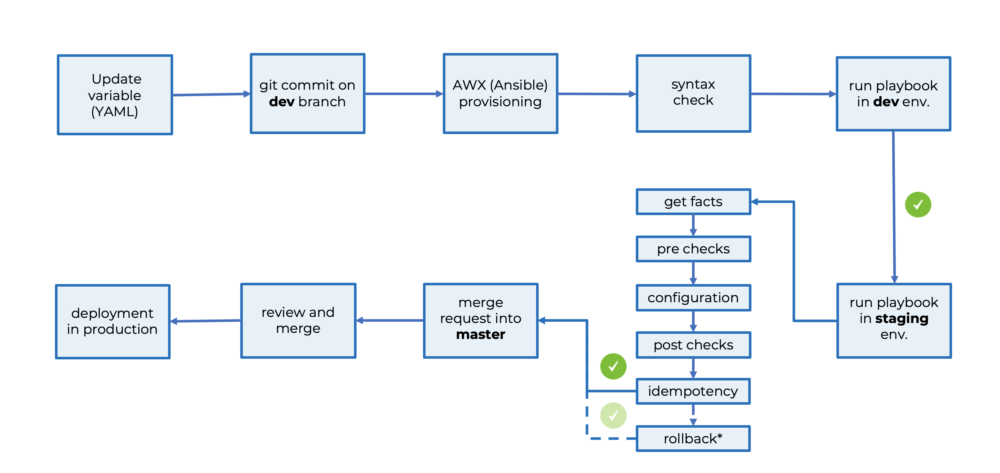

### PRESENTATIONS

Slides and demo available [here](https://drive.google.com/open?id=1Zamehrjm5x2Ou0f3R0oTaQq628rBTn9C)

### ANSIBLE STRUCTURE

```
.
├── README.md
├── ansible.cfg
├── diff
│   ├── lf1.arista.ams.diff
│   ├── lf2.arista.ams.diff
│   └── sp1.arista.ams.diff
├── files
│   ├── lf1.arista.ams.cfg
│   ├── lf2.arista.ams.cfg
│   └── sp1.arista.ams.cfg
├── group_vars
│   ├── all
│   │   ├── generic.yaml
│   │   ├── ntp.yml
│   │   ├── snmp.yaml
│   │   └── syslog.yaml
│   ├── demo_dev
│   │   ├── provider.yml
│   │   └── vty.yml
│   └── demo_replace
│       └── vrfs.yaml
├── host_vars
│   ├── lf1.arista.ams
│   │   ├── bgp.yaml
│   │   ├── interfaces.yaml
│   │   ├── provider.yml
│   │   ├── stp.yaml
│   │   └── users.yaml
│   ├── lf2.arista.ams
│   │   ├── bgp.yaml
│   │   ├── interfaces.yaml
│   │   ├── provider.yml
│   │   ├── stp.yaml
│   │   └── users.yaml
│   └── sp1.arista.ams
│       ├── bgp.yaml
│       ├── interfaces.yaml
│       ├── provider.yaml
│       ├── stp.yaml
│       └── users.yaml
├── hosts.ini
├── pip-selfcheck.json
├── playbooks
│   ├── dev.yml
│   └── render.yaml
├── roles
│   └── demo
│       ├── configurations
│       │   └── README.md
│       ├── handlers
│       │   └── main.yml
│       ├── tasks
│       │   ├── assert.yml
│       │   ├── gather_facts.yml
│       │   ├── main.yml
│       │   ├── ntp.yml
│       │   └── vty.yml
│       └── templates
│           └── ios-vty.j2
├── rollback_lf2.txt
├── templates
│   ├── base.j2
│   └── demo.j2
└── vagrant
    └── Vagrantfile
```

### REPO STRUCTURE

1. When you are doing your work, create a branch and name it yourname_feature_dev. i.e. `federico_syslog_dev`
2. The main trigger of tasks is `main.yml` within the role
3. The `role/tasks/main.yml` file is what runs the tasks, but have separate files, for each type of play (i.e. ntp, banner, etc.’) – the `main.yml` pulls them all together
4. The format of the variable files to be classic yml format: not square brackets but dictionary with colon, and list with dash, like below:

```yaml
---
ntp:
  acl: NTP_ACL
  servers:
    - 205.132.168.209
  source: loopback0
  key: !vault |
          $ANSIBLE_VAULT;1.1;AES256
          30656464656231353837643532656335393536613163356334663364656565343034353961386264
          6631366630336634336632633862616633613063646235350a333866343034333462363334306332
          38373431636261376161666638363866656139303461376435323232393138303837366336366338
          3934333162626261370a323636666564343633343238383138633438626161623765356564383364
          38303332633265616532316164626666396463643736323264303836363934333566383263646662
          3232326431333038346137333562633637353438316130653635
```

5. Variables should be located in `group_vars/all/`  folder with separate file for each service (i.e. ntp/ snmp/ ssh/) etc.
6. Local variables to your role in this case t2c to be kept in `group_vars/t2c/`
7. Save YAML files as .yml (not .yaml) to keep things consistent
8. Save rendered templates files as .cfg
9. Use `loop` instead of `with_items` for playbook loops
10. Each task MUST have the appropriated tags. Each play MUST also have each unique tag (i.e. `- ntp`)

### PROCEDURE

* Fetch or pull Master branch
* Create a dev branch using the following name convention `name_scope_dev` i.e. `federico_ntp_dev`
* Change what required
* Push the changes using a meaningful comment
* If DEV pipeline succeed, raise a merge request from DEV to STAGING
* If STAGING pipeline raise a merge request into MASTE


### PIPELINE STRUCTURE

1. Rember to update the gitlab-ci.yml variables.


